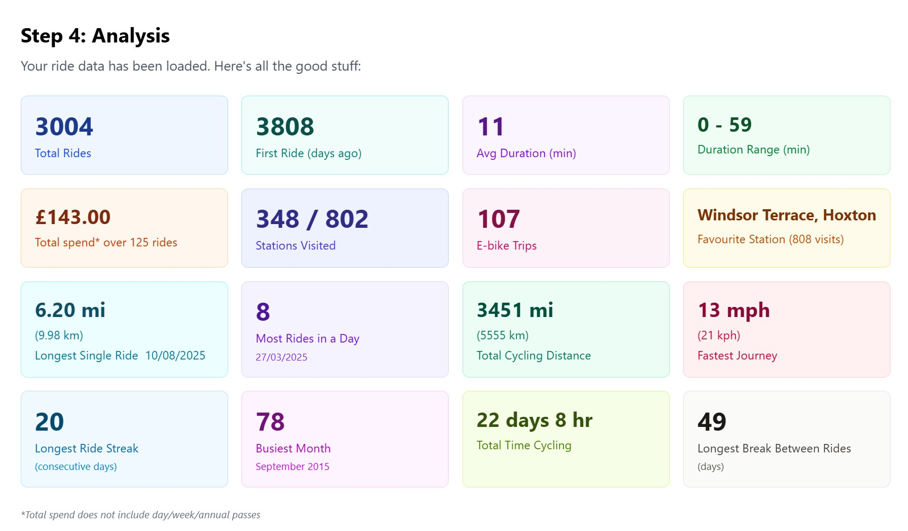
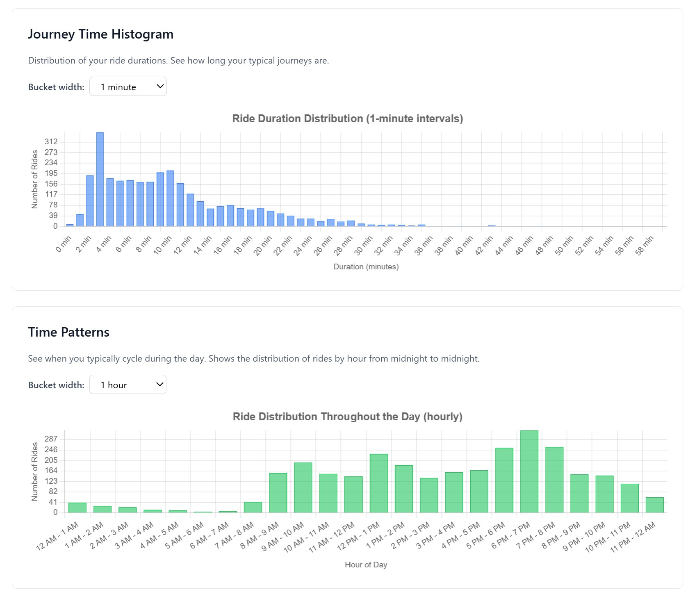
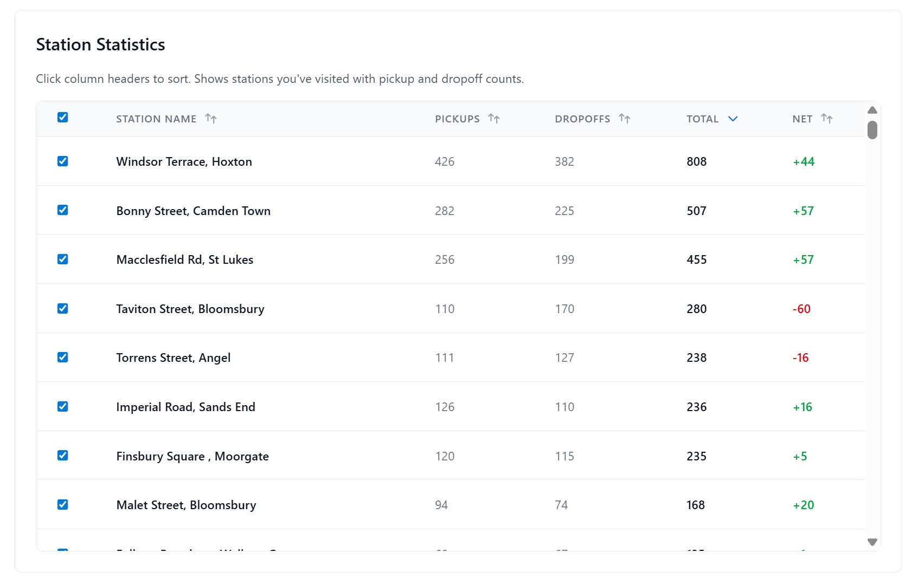
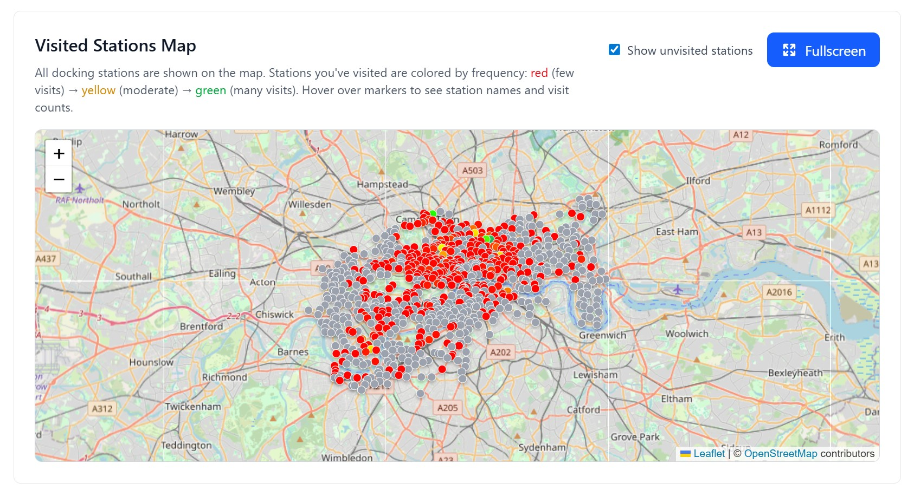
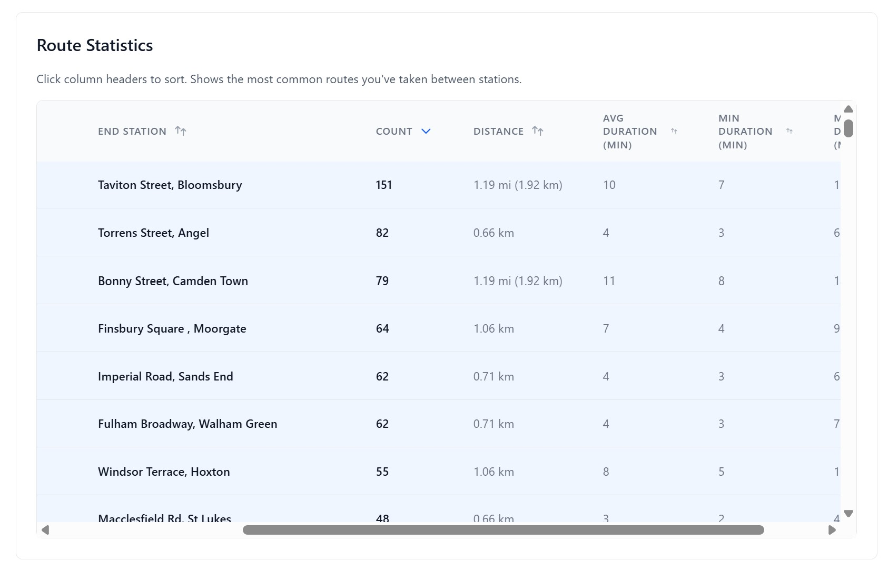
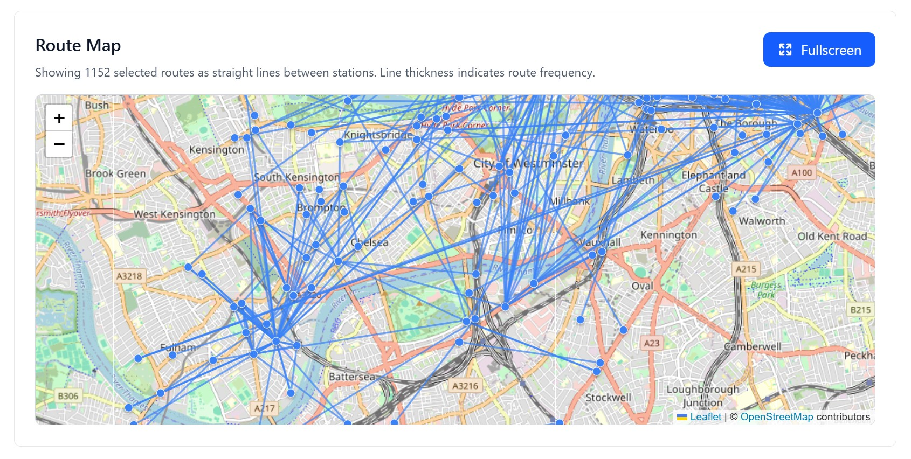

# Santander Cycle Stats

Scrape then view analytics on your Santander Cycle (aka Boris Bike / TfL Cycle Hire) data.

I built this tool to explore my own Boris bike history - check out what you can discover about your rides! Everything runs right in your browser so your data never leaves your machine, and it's all [open source](https://github.com/HCAWN/santander-cycle-stats).

## 🚴 What You Can Do













## Overview

This is a **frontend-only** application that guides users through scraping their own ride history data from the Santander Cycle website, then visualises it locally in their browser. All data processing happens client-side - no data is sent to any server.

## Features

### Current Features

- ✅ Step-by-step guide for scraping ride data
- ✅ Improved browser console scripts with logout detection
- ✅ Data validation and preview
- ✅ Comprehensive statistics display
- ✅ Journey time histogram visualisation
- ✅ Time pattern analysis (time of day, day of week)
- ✅ Interactive route maps using Leaflet
- ✅ Station popularity tables
- ✅ Route frequency analysis
- ✅ Visited stations map

## Tech Stack & Packages

### Core Framework

- **React 19** - Modern React with latest features
- **TypeScript** - Type-safe development
- **Vite 7** - Fast build tool and dev server

### Styling

- **Tailwind CSS 4** - Utility-first CSS framework for rapid UI development
- **@tailwindcss/vite** - Vite plugin for Tailwind CSS

### Data Visualisation

- **Chart.js 4** - Powerful charting library for creating interactive charts
- **react-chartjs-2 5** - React wrapper for Chart.js, used for journey time histograms and time pattern charts

### Maps

- **Leaflet 1.9** - Open-source JavaScript library for mobile-friendly interactive maps
- **react-leaflet 5** - React components for Leaflet, used to display routes and stations on maps
- **@types/leaflet** - TypeScript definitions for Leaflet

### Data Validation

- **Zod 4** - TypeScript-first schema validation library, used to validate ride data structure

### Development Tools

- **ESLint** - Code linting and quality checks
- **TypeScript ESLint** - TypeScript-specific linting rules
- **@vitejs/plugin-react-swc** - Fast React refresh using SWC compiler

## How to Use

### Option 1: Use the Live Version

Visit the [GitHub Pages deployment](https://hcawn.github.io/santander-cycle-stats/) to use the tool directly in your browser.

### Option 2: Run Locally

#### Prerequisites

- Node.js (v18 or higher recommended)
- npm (comes with Node.js)

#### Installation & Running

1. **Clone the repository**

   ```bash
   git clone https://github.com/HCAWN/santander-cycle-stats.git
   cd santander-cycle-stats
   ```

2. **Navigate to the frontend directory**

   ```bash
   cd frontend
   ```

3. **Install dependencies**

   ```bash
   npm install
   ```

   This will install all the packages listed in `package.json`, including React, TypeScript, Vite, Tailwind CSS, Chart.js, Leaflet, and Zod.

4. **Start the development server**

   ```bash
   npm run dev
   ```

   This starts the Vite development server with hot module replacement (HMR), so changes you make will automatically refresh in the browser.

5. **Open in your browser**

   The terminal will display a local URL (typically `http://localhost:5173`). Open this URL in your browser.

### Building for Production

To create an optimised production build:

```bash
cd frontend
npm run build
```

This will:

- Run TypeScript type checking (`tsc -b`)
- Build the application with Vite (`vite build`)
- Output optimised files to `frontend/dist/`

To preview the production build locally:

```bash
npm run preview
```

This serves the built files from `frontend/dist/` so you can test the production build before deploying.

### Scrape Your Data

Follow the step-by-step instructions in the app:

1. **Step 1**: Log into [santandercycles.tfl.gov.uk](https://santandercycles.tfl.gov.uk) and run Script A in the browser console to fetch ride summaries
2. **Step 2**: Run Script B to fetch detailed information for each ride (may need multiple runs if you have many rides)
3. **Step 3**: Paste the JSON data into the app
4. **Step 4**: Explore your data with all the visualisations!

### Scripts Location

The improved scraping scripts are located in:

- `frontend/public/scripts/fetch-ride-summaries.js` - Script A
- `frontend/public/scripts/fetch-ride-details.js` - Script B

These scripts include:

- ✅ Better logout detection (sessions expire after ~15 minutes)
- ✅ Clear error messages and recovery instructions
- ✅ Progress saving (resume from where you left off)
- ✅ Analytics-ready data transformation

## Privacy & Security

- **100% client-side** - All data processing happens in your browser
- **No backend** - No data is sent to any server
- **No tracking** - No analytics, no cookies, no external requests
- **Open source** - You can inspect the code yourself
- You control your data completely

## Development

### Project Structure

```
santander-cycle-stats/
├── frontend/
│   ├── src/
│   │   ├── components/
│   │   │   ├── analytics/        # Analytics visualisation components
│   │   │   │   ├── StatsCards.tsx
│   │   │   │   ├── JourneyTimeHistogram.tsx
│   │   │   │   ├── TimePatternChart.tsx
│   │   │   │   ├── RoutesTable.tsx
│   │   │   │   ├── RoutesMap.tsx
│   │   │   │   ├── StationsTable.tsx
│   │   │   │   └── VisitedStationsMap.tsx
│   │   │   ├── Step1ScrapeSummaries.tsx
│   │   │   ├── Step2ScrapeDetails.tsx
│   │   │   ├── Step3PasteData.tsx
│   │   │   ├── Step4Preview.tsx
│   │   │   └── AnalyticsShowcase.tsx
│   │   ├── hooks/
│   │   │   └── useStations.ts     # Hook for fetching station data
│   │   ├── schemas/
│   │   │   ├── ride.ts           # Zod schemas for ride data validation
│   │   │   └── station.ts       # Zod schemas for station data validation
│   │   ├── types/
│   │   │   ├── ride.ts          # TypeScript types for rides
│   │   │   └── station.ts       # TypeScript types for stations
│   │   ├── App.tsx              # Main application component
│   │   └── main.tsx             # Entry point
│   ├── public/
│   │   ├── scripts/             # Browser console scraping scripts
│   │   │   ├── fetch-ride-summaries.js
│   │   │   └── fetch-ride-details.js
│   │   └── screenshots/         # Screenshots for documentation
│   ├── package.json
│   ├── vite.config.ts
│   ├── tailwind.config.js
│   └── tsconfig.json
├── LICENSE
└── README.md
```

### Available Scripts

- `npm run dev` - Start development server with hot reload
- `npm run build` - Build for production (runs TypeScript check then Vite build)
- `npm run preview` - Preview production build locally
- `npm run lint` - Run ESLint to check code quality

### Adding New Visualisations

The codebase is set up to easily add new visualisations:

1. **Charts**: Use `react-chartjs-2` with Chart.js (already installed)
2. **Maps**: Use `react-leaflet` with Leaflet (already installed)
3. Add your component to `frontend/src/components/analytics/`
4. Import and use it in `Step4Preview.tsx`

## Deployment

This project is automatically deployed to GitHub Pages using GitHub Actions. The workflow:

1. Triggers on pushes to `main` branch
2. Installs dependencies
3. Builds the production bundle
4. Deploys to GitHub Pages

See `.github/workflows/deploy.yml` for the deployment configuration.

## License

MIT

## Disclaimer

This tool is not affiliated with Transport for London or Santander Cycles. Use at your own risk.
